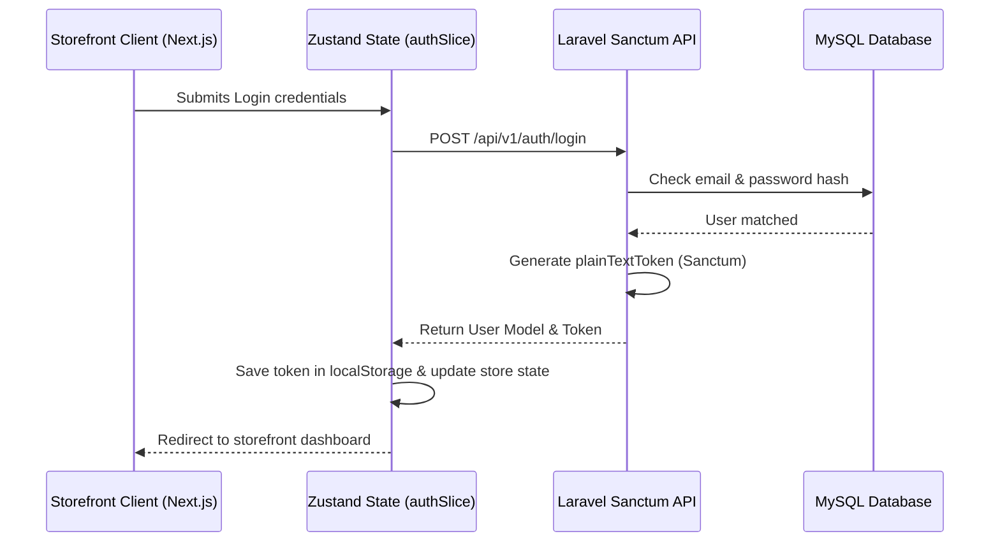

# Developer Notes: Day 3 Architecture Specifications

## 1. Storefront Design Language & Theme

### CSS Variables Layout (`globals.css`)
*   **Typography**:
    *   Primary Headings: `Outfit` (sans-serif)
    *   Body text: `Inter` (sans-serif)
*   **Primary colors**: Rich high-contrast fashion black ink (`oklch(0.145 0 0)`) & luxury cream backgrounds (`oklch(1 0 0)`).
*   **Accent highlights**: Amber/Gold and luxury rose tones.

---

## 2. Authentication Flow Diagram



---

## 3. Client API Authorization Integration

The unified API Fetch wrapper (`src/lib/api.ts`) automatically intercepts outgoing requests:
1.  Checks if `auth_token` is saved in `localStorage`.
2.  If found, appends the following request header:
    ```http
    Authorization: Bearer <token_value>
    ```
3.  Automatically parses JSON responses and catches API validation errors (e.g. `422 Unprocessable Entity`), wrapping them in a standard `ApiError` format that forms map directly to fields.

---

## 4. Protected Routes & Securing Views

Secure directories (like order placement, profile updates, and order lists) must be wrapped inside the `<ProtectedRoute>` guard:
*   Checks if the user session is authenticated.
*   If not authenticated, it automatically redirects the user session back to the `/login` route.
*   While resolving state on load, it displays a premium HSL spinner loading indicator.

---

## 5. cPanel Static Export Setup & Portability

To support cPanel's Apache environment out-of-the-box, Next.js was configured for **Static HTML Export**:
1.  **`output: 'export'`**: Builds pages directly into static `.html` files in `frontend/out/`.
2.  **`unoptimized: true`**: Tells Next.js to skip the default Node-based dynamic image optimization layer.
3.  **`generateStaticParams()`**: Pre-renders dynamic routes like `/product/[id]` into static pages `/product/1.html`, `/product/2.html` up to `/product/8.html` at build time.

---

## 6. Custom SaaS Admin Overrides (Filament Customization)

To convert Filament's default CRUD layouts into a premium custom SaaS design matching Stripe/Linear:
1.  **Mascot Livewire login component**:
    *   Extends `Filament\Pages\Auth\Login` inside `app/Livewire/Auth/CustomLogin.php`.
    *   Tries to authenticate, and if it fails, catches validation errors and dispatches a browser event:
        ```php
        $this->dispatch('login-failed');
        ```
    *   Renders a vector SVG mascot controlled via an AlpineJS component that reacts to field focuses, CapsLock presses, mouse moves, and failure indicators.
2.  **Tabbed Settings Schema (`settings` table)**:
    *   Schema contains unique indexed `key` and nullable `value` fields.
    *   Eloquent helper getter/setter: `Setting::get('site_name')` and `Setting::set('site_name', 'Value')`.
    *   Admin Settings view is split into tab widgets (General, SEO, SMTP) rendering dynamically within custom layout views.
